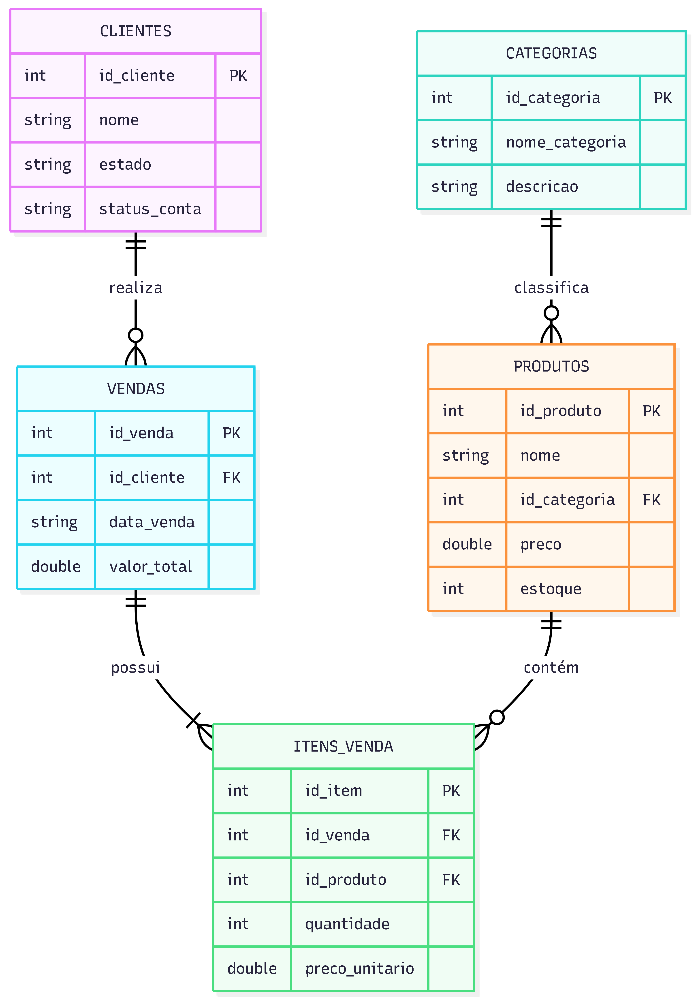

#  Data Platform: E-commerce Architecture

Implementação de uma infraestrutura de dados utilizando **Apache Spark**, 
verificando o comportamento transacional entre **Delta Lake** e **Apache Iceberg**.

---

###  Pilares do Projeto
* **Integridade ACID:** Garantia de consistência em operações de escrita/leitura simultâneas.
* **Schema Enforcement:** Bloqueio de dados inconsistentes através de DDL rigoroso.
* **Time Travel:** Capacidade de auditoria e recuperação de estados anteriores dos dados.
* **Performance:** Otimização de metadados para consultas analíticas complexas.

---

###  Modelagem do Sistema

O ambiente simula o fluxo completo de uma operação de varejo digital (simplificada). Abaixo, a estrutura de relacionamento entre as entidades:

<p align="center">
  
</p>

---

###  Dicionário de Tabelas

Abaixo estão listadas as 5 tabelas que compõem o núcleo do sistema:

| Tabela | Função Principal | Colunas Chave |
| :--- | :--- | :--- |
| **`clientes`** | Gestão de perfis e status de conta dos usuários. | `id_cliente`, `nome`, `estado`, `status_conta` |
| **`categorias`** | Organização lógica do catálogo de produtos. | `id_categoria`, `nome_categoria`, `descricao` |
| **`produtos`** | Inventário mestre com controle de preços e estoque. | `id_produto`, `nome`, `id_categoria`, `preco`, `estoque` |
| **`vendas`** | Cabeçalho das transações financeiras realizadas. | `id_venda`, `id_cliente`, `data_venda`, `valor_total` |
| **`itens_venda`** | Detalhamento granular de itens por carrinho/pedido. | `id_item`, `id_venda`, `id_produto`, `quantidade`, `preco_unitario` |

---

###  Códigos DDL (Data Definition Language)

Abaixo estão os códigos de criação (DDL) das 5 tabelas, separados por etapa de execução:

#### 1. Produtos
```sql
CREATE TABLE produtos (
    id_produto INT,
    nome STRING,
    id_categoria INT,
    preco DOUBLE,
    estoque INT
) USING delta; --ou iceberg;
```

#### 2. Categorias
```sql
CREATE TABLE categorias (
    id_categoria INT,
    nome_categoria STRING,
    descricao STRING
) USING delta; --ou iceberg;
```

#### 3. Clientes
```sql
CREATE TABLE clientes (
    id_cliente INT,
    nome STRING,
    estado STRING,
    status_conta STRING
) USING delta; --ou iceberg;
```

#### 4. Vendas
```sql
CREATE TABLE vendas (
    id_venda INT,
    id_cliente INT,
    data_venda STRING,
    valor_total DOUBLE
) USING delta; --ou iceberg;
```

#### 5. Itens da Venda
```sql
CREATE TABLE itens_venda (
    id_item INT,
    id_venda INT,
    id_produto INT,
    quantidade INT,
    preco_unitario DOUBLE
) USING delta; --ou iceberg;
```

---

### Lógica de Manipulação de Dados (DML)

A manipulação de dados neste projeto foi estruturada para testar quatro operações críticas:

* **Inserção em Lote (Insert):** Teste de ingestão múltipla.
* **Atualização de Estado (Update):** Modificação de registros existentes (Preço e Estoque) com garantia de isolamento.
* **Exclusão (Delete):** Remoção física/lógica de registros do catálogo.
* **Upsert (Merge):** A operação mais complexa, onde o sistema decide entre atualizar ou inserir dados novos em uma única transação.

---

### Visualizar Implementação (DML)
Os códigos de execução e os resultados das tabelas após cada operação podem ser consultados nas páginas **[Delta Lake](delta.md)** e **[Apache Iceberg](iceberg.md)**.